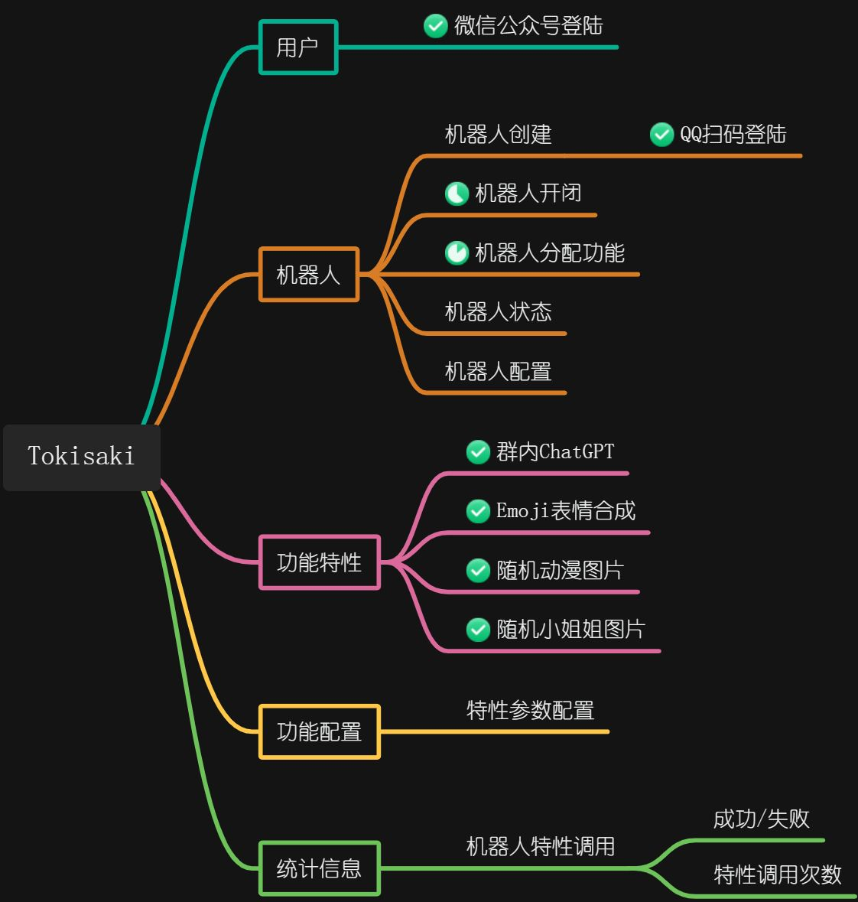

    <h1>✨Tokisaki✨</h1>

---

[visitors](https://visitor-badge.glitch.me/badge?page_id=spcookie.Tokisaki&left_color=green&right_color=red)

只需几个简单的步骤即可启动机器人服务，使用很酷的功能。

> 用于学习的项目，目前正在开发中，提供`http-api`服务

## 🔥开发进度

## 😍技术栈

- Quarkus
- Mutiny
- Vert.x
- Redis
- Postgresql
- Minio
- Quartz
- Mapstruct
- Hutool
- Docker
- mirai
- kotlin-serialization
- resteasy-reactive
- rest-client-reactive
- smallrye-openapi
- smallrye-jwt
- smallrye-fault-tolerance
- hibernate-reactive
- hibernate-validator
- emoji-java

## 🦄支持的机器人

- 逆向QQ机器人

## 🎉功能

| 特性           | 机器人     |
|--------------|---------|
| 群内ChatGPT    | 逆向QQ机器人 |
| 随机小姐姐        | 逆向QQ机器人 |
| 随机动漫         | 逆向QQ机器人 |
| Emoji合成      | 逆向QQ机器人 |
| Midjourney绘图 | 逆向QQ机器人 |

