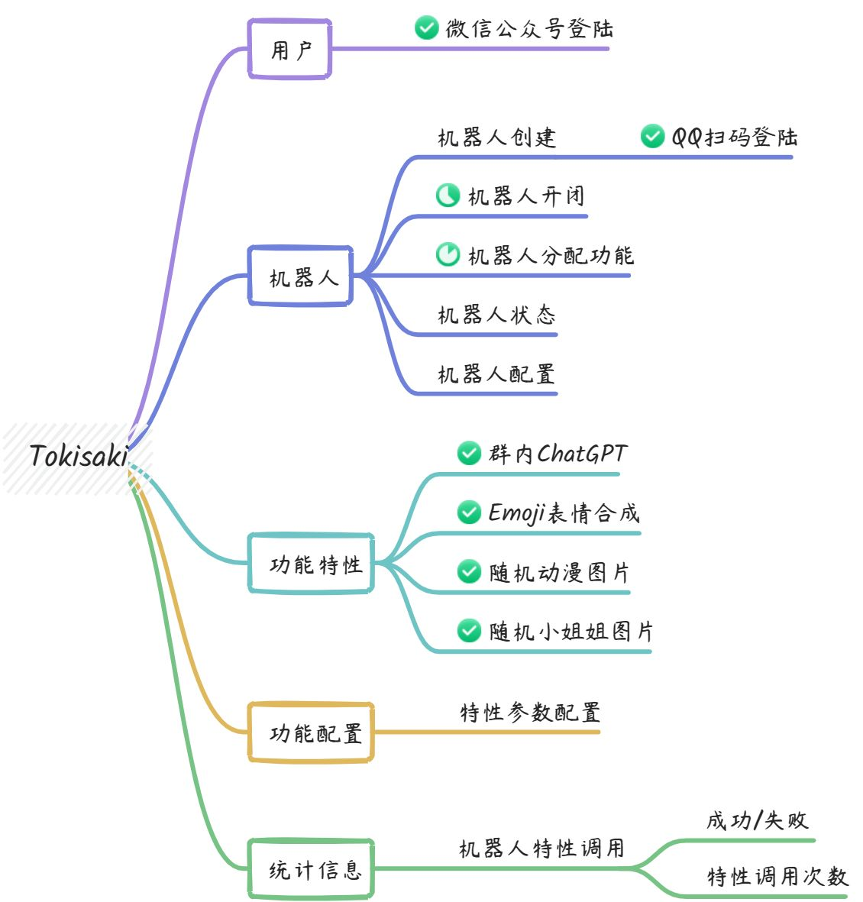
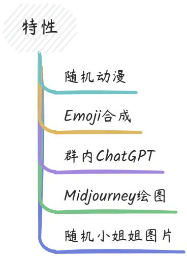

<div align="center">
    <h1>✨Tokisaki✨</h1>
</div>

只需几个简单的步骤即可启动机器人服务，使用很酷的功能。

> 用于学习的项目，目前正在开发中，提供`http-api`服务

## 🎁项目开发模式启动

### 修改配置

修改配置文件`./tokisaki-starter/src/resources/application.yml`中的postgresql、redis、minio的配置

### 启动

```shell
# windows
cd tokisaki-starter && ../gradlew.cmd quarkusDev
```

```shell
# linux macos
cd tokisaki-starter && ../gradlew quarkusDev
```

> 启动后键入`h`获取帮助

## 🔥开发进度

<div align="center">
    
</div>

## 😍技术栈

- Quarkus
- Mutiny
- Vert.x
- Redis
- Postgresql
- Minio
- Quartz
- Mapstruct
- Hutool
- Docker
- mirai
- kotlin-serialization
- resteasy-reactive
- rest-client-reactive
- smallrye-openapi
- smallrye-jwt
- smallrye-fault-tolerance
- hibernate-reactive
- hibernate-validator
- emoji-java

## 🦄支持的机器人

- 逆向QQ机器人

## 🎉功能

<div align="center">
    
</div>

---

